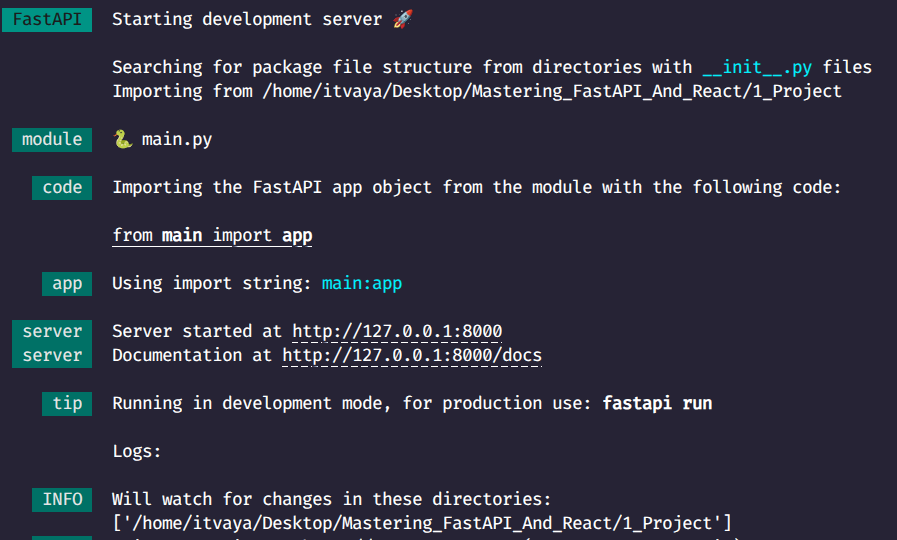
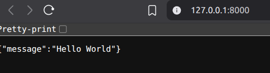
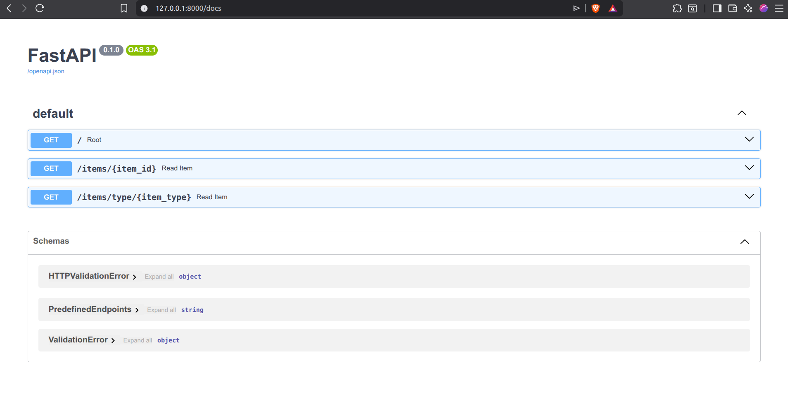
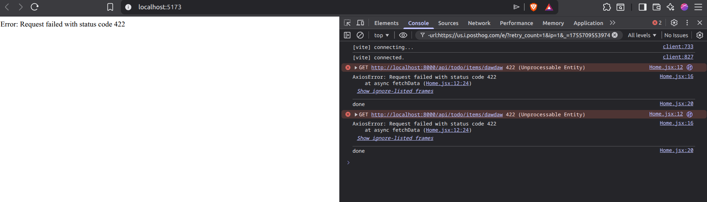
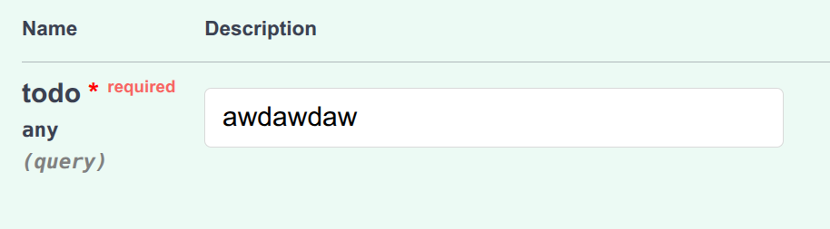
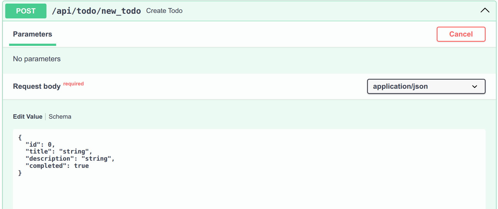
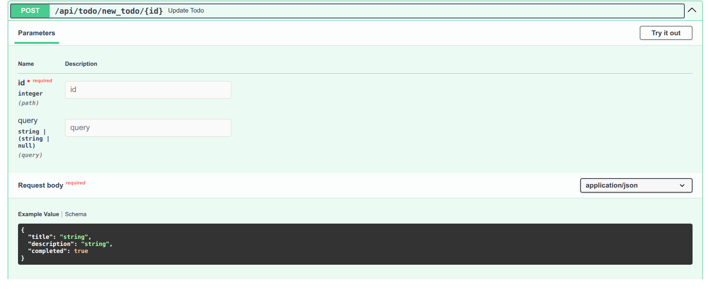

# Introduction to FastAPI with TODOs

Well this is a todo app with `FastAPI + React`! That's it.

But first let's setup the project.

# FastApi installation

We need `python`. Any version higher than 3.9 should work.

If you are in `windows` or `mac` you can download it [here](https://www.python.org/downloads/).

If you are in `linux` you should have it already installed.

Always remember to check the version of `python` you have installed.

```bash
python --version
```

I'll be using `python 3.12.2` for this project.

Now, we need to do some work.

Make a directory with a name of your choice. I named it `1_Project`. Now open it in a code editor of your choice.

Open a terminal(cmd) and navigate to the directory you just created.

And now we are going to make a virtual environment.

What is a virtual environment, you ask?

A `Virtual Environment` is a separate folder that contains all the dependencies of your project. It is a isolated python environment where you can install all the dependencies of your project without effecting your system.

I hope you navigated to the directory you just created. Now, run this command

```bash
python -m venv env
```

This will create a virtual environment named `env` in the current directory.

Now, we need to activate the virtual environment to use it.

```bash
# for windows
.\env\Scripts\activate

# for linux or mac
source env/bin/activate
```

And now, with the virtual environment activated, you can check the version of `python` in the environment.

```bash
python --version
```

To deactivate the virtual environment, run this command,

```bash
deactivate
```

You should see the same version of `python` you have installed.

But this is a completely clean and separate environment.

Ans now we can move on to the next step.

### Installation

Make sure your environment is activated.

And let's install `fastapi`.

```bash
pip install "fastapi[standard]"
```

Now, inside the directory, create a file named `main.py` and add the following code,

```python {.line-numbers}
from fastapi import FastAPI

app = FastAPI()


@app.get("/")
async def root():
    return {"message": "Hello World"}
```

This is a basic `FastAPI` app. I'll go over the code in one second but first let's run the app.

Open the terminal again and run the following command,

```bash
fastapi dev main.py
```

This will start the server and you should see some interesting outputs in the terminal.

But most improtant is the address of the server.


Hover over the address and click on the `ctrl` button and left mouse click on the address this should open the address in you default browser automatically.

And you'll see something like this,



Have we seen this before? > {"message":"Hello World"}

Take a look at the code, in the very last line of the code, we have `return {"message": "Hello World"}`.

So, let's Go line by line.

## Starting the app

In the `main.py` file, we start with the following code.

```python {.line-numbers}
from fastapi import FastAPI

app = FastAPI()
```

The first line imports the `FastAPI` class from the `fastapi` module.

and then we have to specify the `app` variable that initializes the `FastAPI` class.

This will tell make the whole file the starting point of our app.

Then we can straight away make an `api endpoint`,

```python {.line-numbers}

@app.get("/")
async def root():
    return {"message": "Hello World"}
```

The structure of the code is,

```python {.line-numbers}

@app.get("/some_route")
async def some_function():
    #endpoint logic
    return # a dictionary or object
```

`@app.get("/some_route")` is a decorator that makes a backend API endpoint with same name as passed in the decorator.

When you go to that endpoint the function below it will be executed and it will return a dictionary or an object.

> Remember, a endpoint function must return a dictionary or an object.

Now, the path "/" represents the home page of our app. So, whenever you enter the address of the server, you should see the message "Hello World".

One last thing before we go into other topics.

If you take a close look at the code, you'll see that the function is `async`.

If you remove the `async` keyword, the app will work the same as before but it will not be `asynchronous`.

I'll talk more about asynchronous programming later. In the mean time, you can take a look at this [link](https://www.datacamp.com/tutorial/python-async-programming) to learn more about asynchronous programming.

# The project

As we have a project using react and fastapi, we should structure it nicely because we don't want to work in a mess.

So, I'll make two folders inside the `1_Project` folder. 1. Frontend 2. Backend.

I'll move the `main.py` and the `env` directory into the backend folder.

Now, all we have to do is `cd` into `backend` directoy and run the `fastapi run main.py` command.

## features of FastAPI

`FastAPI` is a modern, fast (high-performance), web framework for building APIs.

As we will be building a todo app, we will need a lot of endpoints and many of them can be dynamic.

This is where `FastAPI` comes in handy.

With fast api we can do:

- Dynamic routing
- Query parameters
- Path parameters

And many more.

So, let's say we have a database with a lot of todo items. We want to extract a single todo item from the database.

We cannot really make that many paths manually. So, we can use `path parameters` to do that.

So, let's make a new function inside the `main.py` file,

```python
#backend/main.py

...

async def read_item(item_id: int):
    return {"item_id": item_id}
```

This function will take a `item_id` as a parameter and return a messege that says the `item_id` of the todo item.

So, as we know that it'll take a cirtain `item_id` as a parameter, in the url we need to pass the `item_id` as a parameteras well.

```python {.line-numbers}
#backend/main.py

...

@app.get("/items/{item_id}")
async def read_item(item_id: int):
    return {"item_id": item_id}
```

Now, you might think what is up with the `:` symbol.

This is called a `type hint`. FastAPI can will use this to convert and validate the type of the parameter.

Wher you pass a parameter if it's anything but a number, it'll throw an error.

Here, we are doing a get request to the `/items/{items_id}` endpoint. We can go to that `/items` and then pass the `/2` as a parameter or `/3` as the item id.

This will be a dynamic endpoint and the function will get the `item_id` as a parameter from the url.

So, try it out.

If you enter something other than a number, you'll get an error.

```json
{
  "detail": [
    {
      "type": "int_parsing",
      "loc": ["path", "item_id"],
      "msg": "Input should be a valid integer, unable to parse string as an integer",
      "input": "dawdaw"
    }
  ]
}
```

Also, another thing you need to be careful about is that the order matters.

So, if you have a route like this `/items/all` that will return all the items in the database.

And it's written after `/items/{item_id}`.

It'll have a conflict because `/items/{item_id}` will intercept the request before the `/items/all` route.

## Predefined endpoints

Let's say we have a endpoint that might have multiple parameters. Anything other than the parameters specified it'll not work. In that case we have to manually chekc if the parameters in the url are valid or not.

But fastapi makes things easier for us.

Like we can use a `enum` class to check if the parameter is valid or not.

```python {.line-numbers}
#backend/main.py
from enum import Enum

...

class PredefinedEndpoints(str, Enum):
    life = "life"
    universe = "universe"
    everything = "everything"
```

> Enum is a class that is used to create a list of constants. This enum will work as a type hint and fast api will use this to check if the parameter is valid or not.

It's like a custom type that has a list of constant values.

Now, we can use this enum to check if the parameter is valid or not.

```python {.line-numbers}
#backend/main.py

...

@app.get("/items/type/{item_type}")
async def read_item(item_type: PredefinedEndpoints):
    return {"item_type": item_type}
```

Now, if you enter `/items/type/universe` in the url, it will work.

Anything other than `life`, `universe` or `everything` will not work.

### Docs

Fastapi provides a nice way to document and test your api.

you can go to the `/docs` endpoint to see the docs.



Here, you will see every single endpoint that you have defined in the `main.py` file.

And also you can test the endpoints.

Click and expand the endpoint you want to test.

> Try it out...

One last thing before we start the frontend app.

This is called a `swagger ui`.

There is another built in documentation called `redoc`. You can also access it in the `/redoc` endpoint.

### Query parameters

Query parameters are parameters that are not passed in the url but is passed in the query string.

These are used to do filtering and sorting.

We can pass a query parameter like this,

```python {.line-numbers}
@app.get("/items/{id}")
async def some_function(id: int, q: Optional[str] = None):
    return {"id": id, "q": q}
```

This will take a `id` as a parameter and a `q` as a query parameter.

If the url is a `dynamic` url than the first parameters that has the same name as the url parameter will be treated as the path parameter. Anything other than that will be treated as a query parameter.

> By using the `Optional` type hint, we can make a parameter optional.

With that done let's start the frontend app.

# Starting the React app

You need to have `nodejs` and `npm` installed.

If you don't have it installed, you can download it [here](https://nodejs.org/en/download/).

Before starting the app, I'll install `pnpm`. It's a package manager for `nodejs` and works exactly like `npm` but it's more efficient in terms of memory and performance.

```bash
npm install -g pnpm@latest-10
```

Now, open the terminal and navigate to your root directory and run the following command,

```bash
pnpm create vite
```

Name the project `frontend` and press enter.

then as a framework select `react` and press enter.

select the javascript variant and press enter.

> You can select no for `rolldown-vite`

And after that there should ne no more prompts.

If there is just select `no`.

Now, You'll see that there's a folder created called `frontend` in your root directory.

in the terminal navigate to the `frontend` directory and run the following command,

```bash
pnpm install
```

```bash
pnpm run dev
```

This will start the react app.

Now, open your browser and go to `http://localhost:5173/`. You should see a nice react app... Too bad I'm going to remove every single one of these boilerplate...

But first we need to install some packages.

We will need,

- `axios` for making http requests
- `react-router` for routing
- `bootstrap` for styling

Nagivate to frontend again and run the following command,

```bash
pnpm install react-router bootstrap bootswatch react-icons axios
```

- `bootswatch` is used for bootstrap themes.
- `react-icons` is used for icons.

Now, let's make the frontend app clear and start working.

Open the `frontend` folder and go to the `src` folder. Remove everything inside the `src` folder except the `App.jsx and main.jsx` file.

Now, open the `App.jsx` file and remove everything inside it.

And write the following code,

```jsx {.line-numbers}
//src/App.jsx

function App() {
  return (
    <>
      <h1>TODO</h1>
    </>
  );
}

export default App;
```

Inside the `main.jsx` file, remove the import statements for every css file. The main.jsx file should look like this,

```jsx {.line-numbers}
import { StrictMode } from "react";
import { createRoot } from "react-dom/client";
import App from "./App.jsx";

createRoot(document.getElementById("root")).render(
  <StrictMode>
    <App />
  </StrictMode>,
);
```

Now, that we have a clean frontend app, a small overview of what we are dealing with.

Every line of code will be written inside the `src` directory.

App is the `main component` of the app.

Main is the `root component` of the app.

We will setup router and bootstrap in these files.

But first, let's use axios to fetch data from the backend.

## Fetching data from the backend

Now, make a new folder inside `frontend/src` named `pages` and inside it create a file named `Home.jsx` and add the following code,

```jsx {.line-numbers}
//src/pages/Home.jsx
import React from "react";

const Home = () => {
  return <div>Home</div>;
};

export default Home;
```

This just a simple component setup.

Now, we well add it to the `App.jsx` file,

```jsx {.line-numbers}
//src/App.jsx
import Home from "./pages/Home";

function App() {
  return (
    <>
      <main>
        <Home />
      </main>
    </>
  );
}

export default App;
```

No, we can fetch data in the `Home.jsx` file using `axios`, Let's try it out.

```jsx {.line-numbers}
//src/pages/Home.jsx
import React, { useEffect } from "react";
import axios from "axios";

//function to send http request
const fetchData = async () => {
  try {
    const response = await axios.get("http://localhost:8000/");
    console.log(response.data);
  } catch (error) {
    console.log(error);
  } finally {
    // always executed
  }
};

const Home = () => {
  //fetch data
  useEffect(() => {
    fetchData();
  }, []); // empty array means it will run only once

  return <div>Home</div>;
};

export default Home;
```

Here, I am using `useEffect` hook to fetch data from the backend.

And I am using `axios` to make http requests.

I logged it. So, if you go to the `react server` and open the console in the `inspector`, you should see the data.

BUUUUT, instead of data you see `errors`. The errors are mainly because of the `cors policy`. So, we need to allow cross origin resource sharing.

## Cors policy

The `cors policy` is a security feature in web browsers that prevents cross-origin HTTP requests from being made to a server.

So, the frontend server is not allowed to make http requests to the backend server.

So, what do we do?

We do some configuration in the `backend server` to allow cross origin resource sharing.

Go to the `backend` folder and open the `main.py` file and add the following code,

```python {.line-numbers}
#backend/main.py
from fastapi.middleware.cors import CORSMiddleware

app = FastAPI()

app.add_middleware(
    CORSMiddleware,
    allow_origins=["*"],
    allow_credentials=True,
    allow_methods=["*"],
    allow_headers=["*"],
)

...
```

This is a middleware that allows cross origin resource sharing.

We can use a method of `fastapi` called `add_middleware` to add a middleware to the app.

Inside the `add_middleware` method, we can pass the following arguments,

- `allow_origins` - A list of origins that are allowed to make cross-origin HTTP requests.
- `allow_credentials` - A boolean that indicates whether credentials are allowed in cross-origin requests.
- `allow_methods` - A list of HTTP methods that are allowed in cross-origin requests.
- `allow_headers` - A list of HTTP headers that are allowed in cross-origin requests.

And we can pass `["*"]` to allow all origins.

And now there should be no errors in the console.

> You can also pass a single origin instead of `["*"]` like `["http://localhost:5173"]`.

Now, let's make setup the home page so that the user can see all there todos in the home page.

We should make some dummy data.

Go to the `backend` folder and open the `main.py` file and add the following code,

```python {.line-numbers}
#backend/main.py
from fastapi.middleware.cors import CORSMiddleware

app = FastAPI()

app.add_middleware(
    CORSMiddleware,
    allow_origins=["*"],
    allow_credentials=True,
    allow_methods=["*"],
    allow_headers=["*"],
)

dummy_todo = [
    {
        "id": 1,
        "title": "Todo 1",
        "description": "Description 1",
        "completed": False,
    },
    {
        "id": 2,
        "title": "Todo 2",
        "description": "Description 2",
        "completed": False,
    },
    {
        "id": 2,
        "title": "Todo 2",
        "description": "Description 2",
        "completed": False,
    },
]


@app.get("/")
async def root() -> dict:
    return dummy_todo
```

Now, this dummy data will be fetched in the `Home.jsx` file.

So, we can use it in the `Home.jsx` file,

```jsx {.line-numbers}
import React, { useEffect, useState } from "react";
import axios from "axios";

const Home = () => {
  //defining state
  const [data, setData] = useState([]);
  const [loading, setLoading] = useState(true);
  const [error, setError] = useState(null);

  // reloading data and setting the state
  const fetchData = async () => {
    try {
      setLoading(true);
      const response = await axios.get("http://localhost:8000/");
      console.log(response.data);
      setData(response.data);
    } catch (error) {
      console.log(error);
      setError(error);
    } finally {
      // always executed
      console.log("done");
      setLoading(false);
    }
  };

  useEffect(() => {
    fetchData();
  }, []);

  if (loading) return <div>Loading...</div>;
  if (error) return <div>Error: {error.message}</div>;
  return (
    <div>
      <h1>Home</h1>
      <ul>
        {/* mapping the data to the list */}
        {data.map((item) => (
          <li key={item.id}>{item.title}</li>
        ))}
      </ul>
    </div>
  );
};

export default Home;
```

And after that, we can see the todos in the home page.

Now one big issue that will arise is, while adding code to the `main.py` file as the only point of entry, this file will get very big and messy.

So, we should follow a cleaner structure.

## Refactoring the backend code

So, What we can do it make a new folder named `utils` inside the `backend` folder.

And move the `dummy_todo` variable to the `utils` folder and then import it in the `main.py` file.

And now the `backend/main.py` file should look like this,

```python {.line-numbers}
#backend/main.py
dummy_todo = [
    {
        "id": 1,
        "title": "Todo 1",
        "description": "Description 1",
        "completed": False,
    },
    {
        "id": 2,
        "title": "Todo 2",
        "description": "Description 2",
        "completed": False,
    },
    {
        "id": 3,
        "title": "Todo 3",
        "description": "Description 3",
        "completed": False,
    },
]

```

Now the `main.py` file should look like this,

```python {.line-numbers}
#backend/main.py
from fastapi import FastAPI
from enum import Enum
from fastapi.middleware.cors import CORSMiddleware
# dummy data from utils
from utils.dummy import dummy_todo

app = FastAPI()

app.add_middleware(
    CORSMiddleware,
    allow_origins=["*"],
    allow_credentials=True,
    allow_methods=["*"],
    allow_headers=["*"],
)


@app.get("/")
async def root()-> list:
    return dummy_todo

@app.get("/items/{item_id}")
async def read_item(item_id : int):
    return {"item_id": item_id}


class PredefinedEndpoints(str, Enum):
    life = "life"
    universe = "universe"
    everything = "everything"

@app.get("/items/type/{item_type}")
async def read_item_type(item_type: PredefinedEndpoints, q: str | None = None):
    return {"item_type": item_type, "q": q}
```

Looks cleaner but we have other issues like the `main.py` file is getting very big with all the routs and can be hard to figure out which endpoint is which.

So, we should do some `routing`.

## Routing

What is routing?

Routing is the process of mapping URLs to specific endpoints in a web application.

This will help us organize our code into different files and modules and keep the code clean and easy to understand.

So, what we are going to do is split our code into different apps.

Sor example we are making a `todo` app we can split this backend code into two folder one is for the todo and another one is for the authentication or the user management.

So, in this case. Let's make a folder named `todo` inside the `backend` folder.

And inside that folder we can make a file named `router.py`. In this file we can define the routes for the todo app APIs.

Write this code in the `router.py` file,

```python {.line-numbers}
#backend/todo/router.py
from fastapi import APIRouter

router = APIRouter(
    prefix="/todo",
    tags=["todo"],
)

```

> This will set up the router for the todo app.

APIRouter is a class that is used to create a router for a FastAPI application.

Inside we are passing some arguments to the `APIRouter` class.

- `prefix` - This prefic will be added to all the urls in the router.
  - For example: I've set the prefix to `/todo` so all the urls in this router will start with `/todo` like `/todo/index` or `/todo/create`.

- `tags` - This will be used to group the routes in the swagger docs. The built-in FastAPI docs will group the routes by the tags.

Now, we can add this router inside the `main.py` file,

```python {.line-numbers}
#backend/main.py
from fastapi import FastAPI
from fastapi.middleware.cors import CORSMiddleware
from utils.dummy import dummy_todo
from todo.router import router
app = FastAPI()

app.add_middleware(
    CORSMiddleware,
    allow_origins=["*"],
    allow_credentials=True,
    allow_methods=["*"],
    allow_headers=["*"],
)

app.include_router(router, prefix="/api")

@app.get("/")
async def root():
    return dummy_todo

```

> Remember to add `__init__.py` files to all the folders you create.

We can use the `include_router` method to include the router in the main app.

And cut every single line of code from the `main.py` file and paste it in the `router.py` file.

and after renaming the `variables` and functions inside the `router.py` file,

```python {.line-numbers}
#backend/todo/router.py
from fastapi import APIRouter
from utils.dummy import dummy_todo
from enum import Enum
router = APIRouter(
    prefix="/todo",
    tags=["todo"],
)

@router.get("/")
async def root()-> list:
    return dummy_todo

@router.get("/items/{item_id}")
async def read_item(item_id : int):
    return {"item_id": item_id}


class PredefinedEndpoints(str, Enum):
    life = "life"
    universe = "universe"
    everything = "everything"

@router.get("/items/type/{item_type}")
async def read_item_type(item_type: PredefinedEndpoints, q: str | None = None):
    return {"item_type": item_type, "q": q}

```

We just had to rename the `app` to `router` and we if we look at the server, everything is working fine.

Now, you shouls also see a group in the `swagger` docs.

No,w with that I think we have a nice setup for our todo app.

So, we should move on to setting up a database to store our data.

But before that I have to talk about somethings that I should not slack of on right now.

> We have to use the `/api/todo` prefix in the urls now.

## Error Handling

Now we know that when we pass a path parameter that is not defined we get a error in the server like below.

```json
{
  "detail": [
    {
      "type": "int_parsing",
      "loc": ["path", "item_id"],
      "msg": "Input should be a valid integer, unable to parse string as an integer",
      "input": "dawdaw"
    }
  ]
}
```

Now we shoudl really check if it's a error or not.

So, let's go to the react app and see if we can fetch data from a wrong path parameter.

We just update the `fetchData` function,

```jsx {.line-numbers}
//src/pages/Home.jsx

....

const fetchData = async () => {
    try {
      setLoading(true);
      const response = await axios.get("http://localhost:8000/api/todo/items/dawdaw");
      console.log(response.data);
      setData(response.data);
    } catch (error) {
      console.log(error);
      setError(error);
    } finally {
      // always executed
      console.log("done");
      setLoading(false);
    }
  };

```

> Now if you look at the screen you can see that it is an error but it is a 422 status code.



Now, what is a status code?

Status codes are used to indicate the `success` or `failure` of a request.

Different status codes have different meanings.

> 200 means good.
> 400 means bad.

You can go to this [wikipedia](https://en.wikipedia.org/wiki/List_of_HTTP_status_codes) page to see all the status codes.

Mainly, The status code are divided into 5 groups.

- `1xx` - Informational.(ex: 100 Continue, 101 Switching Protocols)
- `2xx` - Success.(ex: 200 OK, 201 Created)
- `3xx` - Redirection.(ex: 301 Moved Permanently, 302 Found)
- `4xx` - Client Error.(ex: 400 Bad Request, 401 Unauthorized)
- `5xx` - Server Error.(ex: 500 Internal Server Error, 503 Service Unavailable)

So, anything starting with `4` means an error with the request.

Anything starting with `5` means an error with the server.

Now, what is `422` status code?

It means the request was well-formed but was unable to be followed due to semantic errors.

Which is actually correct because the path parameter `item_id` is not a valid integer.

But what if we want to return a custom error message?

Let's say if path parameter is greater than 10 we want to return a custom error message.

```python {.line-numbers}
#backend/todo/router.py
@router.get("/items/{item_id}")
async def read_item(item_id : int):
    if item_id > 10:
        return {"error": "item_id should be less than 10"}

    return {"item_id": item_id}
```

Now, if we modify the `fetchData` function again and pass a path parameter greater than 10,

This message will be displayed,

But the problem is it is not displayed as an error.

So, we should set the status code to something that corresponds to the error. Simply we can say that the path we are searching for is `not found`.

```python {.line-numbers}
#backend/todo/router.py
from fastapi import APIRouter, status, Response

...

@router.get("/items/{item_id}")
async def read_item(item_id : int, response: Response):
    if item_id > 10:
        response.status_code = status.HTTP_404_NOT_FOUND # setting the status code
        return {"error": "item_id should be less than 10"}

    return {"item_id": item_id}

...

```

We can change the response status code to something that corresponds to the error.

To do that we need to import the `Response` class and the `status` module from the `fastapi` library.

In the function for an API endpoint, we can use a extra parameter called `response` which will be an instance of the `Response` class.

This parameter will be completely optional. And we can now use the response object to set the status code.

This response object has a lot of response attributes one of them is `status_code` which we can use to set the status code.

# Defining a custom Type

Now if you take a look at the `/api/todo` endpoint, you can say that it is a list of todo items.

But this is actually not a list of todo items. It is a list of objects and each object has a `id`, `title`, `description` and `completed` attribute.

But in the `docs` in teh example response you can see that it is a list of todo items.

So, How do we define this for better documentation?

Well, we can define a custom type.

These custom types are called `schema` in fastapi.

Too keep the code clean and readable we should define the schema in a separate file.

So, make a file inside the `backend/todo` folder called `schemas.py` and write the following code,

```python {.line-numbers}
#backend/todo/schemas.py
from pydantic import BaseModel

class Todo(BaseModel):
    id: int
    title: str
    description: str
    completed: bool
```

Now we import the `Todo` class from the `schemas.py` file.

```python {.line-numbers}
#backend/todo/router.py
from fastapi import APIRouter, status, Response
from utils.dummy import dummy_todo
from todo.schemas import Todo


@router.get("/")
async def root()-> list[Todo]:
    return dummy_todo

```

Now if you go to the `docs` and take a look at the response, you can see that in the response example it is showing the `Todo` schema that we defined.

You can also do it like below,

```python {.line-numbers}
#backend/todo/router.py
from fastapi import APIRouter, status, Response
from utils.dummy import dummy_todo
from todo.schemas import Todo

@router.get("/", response_model=list[Todo])
async def root():
    return dummy_todo
```

For better understanding of the `api` you can also write a description and summary for the endpoint.

```python {.line-numbers}
#backend/todo/router.py
from fastapi import APIRouter, status, Response
from utils.dummy import dummy_todo
from todo.schemas import Todo

@router.get(
    "/",
    response_model=list[Todo],
    summary="Get all todo items",
    description="This endpoint will return a list of all todo items in the database.",
)
async def root():
    return dummy_todo

...
```

Or you can also write a docstring for the function and it will be used as the description in the docs.

```python {.line-numbers}
#backend/todo/router.py
from fastapi import APIRouter, status, Response
from utils.dummy import dummy_todo
from todo.schemas import Todo

@router.get(
    "/",
    response_model=list[Todo],
    summary="Get all todo items",
)
async def root():
    """
    - **This endpoint will return a list of all todo items in the database.
    - **This is a dummy endpoint and it will return the same data every time.**
    """
    return dummy_todo

...
```

You can also define `response_description` which will be used as the description in the docs.

Try to do it yourself.

Now, we need to talk more about path parameters.

Backend, not only just sends data it can also recieve data through post request.

So, let's see how we can do that.

# In-depth Path parameters

When the user wants to create something or store something or send something to the backend it is done by sending a post request.

Post request always carries data.

So, in that case let's see how we can define a post request.

```python {.line-numbers}
#backend/todo/router.py

...

@router.post("/new_todo")
async def create_todo(todo):
    return todo

...
```

Here, we have a function called `create_todo` which will be called when the user sends a post request to the `/api/todo/new_todo` endpoint and then we are returning the todo object.

So, let's see what happens when we test it in the docs.

If you try it out you should see that it is expecting a todo object as a query parameter.



When you enter something it will return what you entered.

This is not a good way to do it.

Because most of the time the user won't just send some `string` they will send a `json` object.

Which is then validated and converted into the backend object so that the backend store it in the database.

This is where `pydantic` comes in.

remember I told you before that `typing` in fast api is not just python typing it actually `validates` and `converts` the data.

So, to fullfill our curiosity let's just set the type of the parameter to `Todo` and see what happens.

```python {.line-numbers}
#backend/todo/router.py
...


@router.post("/new_todo")
async def create_todo(todo: Todo):
    return todo

...
```

Now, take look at the `docs`. You should see that now it is expecting a `Todo` object and the quesry parameter is gone.

Instead of that there is something called `request body` which is used to send data to the backend.

Now, inside the request body you can see the `Todo` object.

And now click on the try it out cutton to edit the request body.



Now, when you enter something it will return what you entered as a todo object.

So, now fastapi is recognizing that this is a post request and it is expecting a `Todo` object in the request body.

But what about the validation part?

> We should test out if the validation is working properly.

> Try to put different type of data and see what happends.

But before that I'll make a new `pydantic` class to represent the `todo_request` object. Because the `Todo` class is used for the response and the `todo_request` class is used for the request.

```python {.line-numbers}
#backend/todo/schemas.py

from pydantic import BaseModel

class todo_request(BaseModel):
    title: str
    description: str
    completed: bool
```

Now, let add the response model and the request model to the `create_todo` function.

```python {.line-numbers}
from fastapi import APIRouter, status, Response
from utils.dummy import dummy_todo
from enum import Enum
from todo.schemas import Todo, Todo_Request

...

@router.post(
        "/new_todo",
        response_model=Todo # This is the response model
)
async def create_todo(todo: Todo_Request):
    return todo

```

I'm doing this because most of the time the responce and requests have a very similar structure but it's not completely the same.

Now, there arrieves another issue.

As we are sending a post request to a static url we are making a simple parameter be recognized as a request body.

## Path, query and request body

But what if that is a dynamic url?

What is this url needs a extra query parameter?

How can we define that.

In this case:

- The parameter with pydantic `basemodel` will be recognized as a request body.
- The parameter with the same name to the dynamic url parameter will be recognized as a parameter.
- Anything other than that will be recognized as a query parameter.

So, let's see if this works or not.

let's define a new post request endpoint.

```python {.line-numbers}
from fastapi import APIRouter, status, Response
from utils.dummy import dummy_todo
from enum import Enum
from todo.schemas import Todo, Todo_Request

...

@router.post("/new_todo/{id}",)
async def update_todo(todo: Todo_Request, id: int, query: str | None = None):
    return {
        "id": id,
        "data": todo,
        "query": query
    }

...
```

Now, if you take a look at the `docs` you can see that the `id` is a path parameter and the `todo` is a request body and the `query` is set as a query parameter.



> Remember the path parameter must have the same name as the dynamic url parameter.

## Defining Metadata

As fast api is a library that is used to build APIs. It give's a lot of control over the API. So much that we can define metadata for the parameters.

As we have seen there are three types of parameters.

- Path parameters
- Query parameters
- Request body

You can define metadata for each of them.

For query parameters you can use a function called `Query` and for path parameters you can use a function called `Path`.

You can define them like this,

```python {.line-numbers}
#backend/todo/router.py

from fastapi import APIRouter, status, Response, query, path, Body

...

@router.post(
    "/new_todo/{id}",
)
async def update_todo(
    todo: Todo_Request,
    id: int = Path(..., title="The ID of the todo to update", description="The ID of the todo to update"),
    query: str | None = None
    ):
    return {
        "id": id,
        "data": todo,
        "query": query
    }

...
```

You can pass arguments like:

- `Default` - To set a default value.
  - `...` or `ellipsis` - To make the parameter required.
- `title` - To set a title for the parameter.
- `description` - To set a description for the parameter.
- `alias` - To set an alias for the parameter.
- `gt` - To set a minimum value for the parameter.
- `lt` - To set a maximum value for the parameter.
- `max_length` - To set a maximum length for the parameter if it is a string.
- `min_length` - To set a minimum length for the parameter if it is a string.
- `regex` - To set a regular expression for the parameter if it is a string.

Now, take a look at the `docs`, you'll see the description for the `id` parameter.

> gt = greater than, lt = less than, max_length = maximum length, min_length = minimum length, regex = regular expression.

> These arguments are called `validators` in fastapi. we can use them to validate the parameters.

We've talked a lot about these metadata stuff where is the good stuff?

# Database

FastApi does not provide you with a stand alone `ORM` to work with databases.

So, we have freedom to choose any `ORM` that we want.

For the time being, we have two choices:

- `SqlModel`
- `SQLAlchemy`

`SqlModel` is made by the creator of fastapi and internally made with `SqlAlchemy` and `pydantic`. It's also documented in the `fastapi` documentations.

But a lot of it still not a mature library. Although easy to use a lot of depp ORM concepts are abstracted away.

So, I'll use `SqlAlchemy` for this project.

run the following command to install `sqlalchemy`,

```bash
pip install SQLAlchemy
```

So, let's setup a database.

## Setting up a database

Make a new file and name it `database.py` in the root `backend` folder.

```python {.line-numbers}
#backend/database.py
from sqlalchemy import create_engine
from sqlalchemy.ext.declarative import declarative_base
from sqlalchemy.orm import sessionmaker

DATABASE_NAME = "todo.db"

SQLALCHEMY_DATABASE_URL = f"sqlite:///{DATABASE_NAME}"

engine = create_engine(SQLALCHEMY_DATABASE_URL, connect_args={"check_same_thread": False})

SessionLocal = sessionmaker(autocommit=False, autoflush=False, bind=engine)

Base = declarative_base()

```

Just copy and paste the above code into the `database.py` file.

Now let's go line by line.

First we have to define the database name and the database url.

> I'll be using `sqlite` for this project and later we will see how we can connect other databases.

```python {.line-numbers}
#backend/database.py
DATABASE_NAME = "todo_db.db"
SQLALCHEMY_DATABASE_URL = f"sqlite:///{DATABASE_NAME}"
```

> SQLite is a light weight database that is used for small projects and testing. It is not production ready but can be used to check if the code is working or not then switch to a production database.

> These are constants so by convention I'm using `UPPER_CASE` for constants.

Now, The next step is to create the database.

To do that we need the `create_engine` function. This function will look for the database and create it if it doesn't exist, for `sqlite` databases at least.

```python {.line-numbers}
#backend/database.py
engine = create_engine(SQLALCHEMY_DATABASE_URL, connect_args={"check_same_thread": False})
```

> We pass the `SQLALCHEMY_DATABASE_URL` to the `create_engine` function and it will create the connection to the database.

> Also I passed the `check_same_thread` argument to the `connect_args` argument.

In fastapi the functions can be asynchronous or synchronous. If we set the api endpoints to asynchronous we have might have multiple threads running at the same time.

Sqlite is a `single thread` database and rejects requests from multiple threads. So, we need to tell him it is ok to accept requests from multiple threads in this same connection.

that's why we pass the `check_same_thread` argument as `False` to the `connect_args` argument.

Now, we make a session.

What is a session?

A session is a connection to the database. It's like meeting we set when we want to send or retrieve data from the database. after creating the engine we create the session so that we can use it later to send or retrieve data from the database.

```python {.line-numbers}
#backend/database.py
SessionLocal = sessionmaker(autocommit=False, autoflush=False, bind=engine)
```

> `autocommit=False` means that we don't want to commit the changes to the database automatically. We want to commit the changes manually so that unwanted changes are not committed to the database.

> Flush means Sending the data to the database memory before saving ir permanently to the database. It controls when the data transfer will happen. By setting it to `False` we are saying until we explicitly `commit` the changes to the database do not send them to the database.

> `bind=engine` means that we want to bind the session to the engine.

Now, to make our database models we need to make a declarative base class.

```python {.line-numbers}
#backend/database.py
Base = declarative_base()
```

> We are going to use this class to create our database models.

Now, let's configure fastapi to use our database.

To use the databse we will need the session.

So, we can make a function to get the session.

```python {.line-numbers}
#backend/database.py
def get_db():
    with SessionLocal() as db:
        yield db
```

Here, we are initializing the session as a context manager and getting the session as a yield.

When the context manager is exited, the session will automatically close.

> More simply, this function will give us the session by which we can send or retrieve data from the database. Once the session is closed the connection will be closed.

Now, Let's make a table for our database. Create a new file and name it `models.py` in the `todo` folder.

```python {.line-numbers}
#backend/todo/models.py
from database import Base
from sqlalchemy import Column, Integer, String, Boolean

class Todo(Base):
    __tablename__ = "todo"
    id = Column(Integer, primary_key=True, index=True)
    title = Column(String)
    description = Column(String)
    completed = Column(Boolean)

```

This is the most basic table we can make.

Every Database has some tables and these table are called models.

Each model represents a table in the database.

Here the `Todo` model represents the `todo` table in the database. It inherits from the `Base` class from the `database.py` file.

And the `__tablename__` attribute is the name of the table in the database.

Then we have the `id`, `title`, `description` and `completed` attributes which are the columns in the table.

We have to specify the data type of each column.

The `id` column is an integer and it is the primary key and it is also indexed.

> Primary key is a unique identifier for each row in the table and it is a must have for every table.

The id will be both the primary key and the index of the table.

Also primary key can be any column in the table that has complete uniqueness.

Like `email`, `NID` etc.

Now, let's migrate the database.

> Migration is the process of changing the structure of the database or just updating the structure of the database.

We have almost evrything set up, so go to the `main.py` and paste the following code,

```python {.line-numbers}
#main.py
from fastapi import FastAPI
from enum import Enum
from fastapi.middleware.cors import CORSMiddleware
from todo.router import router
from database import Base, engine # import the engine and Base class.
from todo import models # import the Todo model

...

models.Base.metadata.create_all(bind=engine) # create the table in the database

```

> `models.Base.metadata.create_all(bind=engine)` will create the table in the database.

Now you should see a new file named `todo_db.db` in the `root` folder.

And we have a working sqlite database. If you are using vs code you can install the `sqlite3 editor` extension and open any sqlite database in it.

But the work is not done yet.

## Creating data in the database

Let's say the user will create a todo item.

We already have a `endpoint` to create a todo item.

Now, let's go to the `router.py` file and paste the following code,

```python {.line-numbers}
#backend/todo/router.py
from fastapi import APIRouter, status, Response, Query, Path, Body, Depends
from utils.dummy import dummy_todo
from enum import Enum
from todo.schemas import Todo, Todo_Request
from database import get_db # import the function to get the session
from sqlalchemy.orm import Session # import the session to reference
from todo.models import Todo as TodoModel # import the Todo model as TodoModel to avoid conflicts
 
...
    

@router.post(
        "/new_todo", 
        response_model=Todo
)
async def create_todo(request: Todo_Request, db: Session = Depends(get_db)):
    new_todo = TodoModel(
        title=request.title,
        description=request.description,
        completed=request.completed
    )
    db.add(new_todo)
    db.commit()
    db.refresh(new_todo)
    return new_todo
```

Just like request body is recognized as a request body via `pydantic`, we have to define the session as a dependency.

Now, what is a dependency?

When we are in a situation where we want to use something(a function) that is already defined but the parameter is not defined in the function, we have to use a dependency.

`Depends` is a function that is used to define a dependency.

When the function is called it will return the session and the session will be passed to the function as a parameter.

Any parameter with `Depends` will be a dependency and automatically activate the funciton inside it when the function is called.

> When a parameter is set as a dependency it will not be a path parameter or a query parameter.

So, after that we can use the session through the `db` variable.

But first we need to `serialize` the request body.

> Serialization is the process of converting data from one format to another.

When the request body is received it will be in json format which is defined by the `todo_request` schema. We can convert it using the `Todo` Model we created for our database.

So, let's import the `Todo` model form `todo/models.py` file.

But there is a conflict there is another class named `Todo` in the `todo/schemas.py` file.

So, we can either rename one class in their file or just use `as` to rename after importing them.

I did the later one.

Now to convert the request body to the `Todo` model we can follow the following steps,

```python {.line-numbers}
#backend/todo/router.py
new_todo = Todo(
    title=request.title,
    description=request.description,
    completed=request.completed
)
```

In the todo model we have a `title`, `description` and `completed` field and we are getting the reuqest body from the user that has the `request.title`, `request.description` and `request.completed` field.

So, we can pass them to the `Todo` model and it'll be converted to the `Todo` model.

And then we can add it to the database, commit it and refresh it.

```python {.line-numbers}
#backend/todo/router.py
db.add(new_todo)
db.commit()
db.refresh(new_todo)
```

> `db.add(new_todo)` will add the new todo to the database.
> `db.commit()` will commit the changes to the database.
> `db.refresh(new_todo)` will refresh the new todo in the database.

Then we can return the new todo to the user as confirmation.